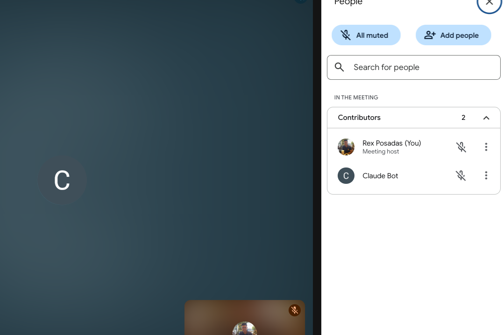

# Attendee MCP Server


This is an MCP for sending and managing meeting bots with  [Attendee](https://github.com/attendee-labs/attendee), an open-source meeting bot for recording and transcription. You can run Attendee locally or deploy it to the cloud.

Questions? Join the Attendee [Slack](https://join.slack.com/t/attendeecommu-rff8300/shared_invite/zt-2uhpam6p2-ZzLAoVrljbL2UEjqdSHrgQ).

## Quick Start: What can you do with this MCP? 

Using Claude as an example: You can type the following and start working with an AI meeting bot.  

1. "Send a bot to this meeting: <meeting_url>"
2. "Have the bot speak <message>", and the bot would speak it in the meeting.
3. "Have the bot send a chat message: <message>"
4. "Have the bot leave the meeting"



## Combining MCPs 
Combining MCPs leads to powerful workflows. For example, I use the Brave Search MCP alongside the Attendee MCP. When I ask Claude, “Who won the last Roland Garros tournament?”, it:

1. Uses the web MCP to find the answer online.
2. Pipes the result to the Attendee bot, which speaks the answer back to me

## 🚀 Installation

We will use Claude as an example, but you can use any tool that works with MCPs.

### Clone the repository

```bash
# Clone your fork or the main repo
git clone https://github.com/rexposadas/attendee-mcp.git
cd attendee-mcp

# Install dependencies
npm install

# Build the TypeScript
npm run build

# Link for global use
npm link
```

## ⚙️ Configuration

### Environment Variables

Set these environment variables for your Attendee server:

```bash
export MEETING_BOT_API_URL="http://localhost:8000"  # Your Attendee server URL
export MEETING_BOT_API_KEY="your-api-key-here"     # Your Attendee API key
```

Add these to your shell profile (`~/.zshrc`, `~/.bashrc`, etc.) to make them permanent.

### Claude Desktop Configuration

Update your Claude Desktop configuration file at:
`~/Library/Application Support/Claude/claude_desktop_config.json`. after you make the changes, restart Claude 

#### Adjust the `mcpServers` section to include the Attendee MCP server.  Use the direct path for now since that's proving to be the most reliable.

```json
{
  "mcpServers": {
    "attendee": {
      "command": "node",
      "args": [
        "<path>/attendee-mcp/dist/index.js"
      ],
      "env": {
        "MEETING_BOT_API_URL": "<attendee-url-here>",
        "MEETING_BOT_API_KEY": "your-api-key-here"
      }
    }
  }
}
```

Replace `/path/to/attendee-mcp` with the actual path where you cloned the repository.

## 🏃‍♂️ Quick Start if you want to run Attendee Locally. 

1. **Start your Attendee server:**
   ```bash
   make build
   make up
   ```
1. **Test in Claude Desktop:**
   - Ask Claude: "What MCP tools are available?"

## 🎯 Usage Examples

Once configured, you can use natural language commands in Claude Desktop:

### Creating Meeting Bots
- "Create a meeting bot for this Zoom: https://zoom.us/j/123456789"
- "Send a bot to this Google Meet: https://meet.google.com/abc-defg-hij"
- "Join this Teams meeting with a bot: https://teams.microsoft.com/..."

### Managing Bots
- "What's the status of bot bot_abc123?"
- "Show me all my active bots"
- "List all meeting bots"
- "Remove bot bot_abc123 from the meeting"

## 🔧 Available MCP Tools

This server provides the following tools:

### Core Bot Management
- **`create_meeting_bot`** - Create a bot to join and record a meeting
- **`get_bot_status`** - Check the current status of a meeting bot
- **`list_meeting_bots`** - List all active meeting bots
- **`remove_meeting_bot`** - Remove a bot from a meeting

### Communication & Media
- **`make_bot_speak`** - Make the bot speak using text-to-speech
- **`send_chat_message`** - Send chat messages from the bot
- **`send_image_to_meeting`** - Display images through the bot (Google Meet only)
- **`send_video_to_meeting`** - Play videos through the bot (Google Meet only)

### Data Retrieval
- **`get_meeting_transcript`** - Retrieve the meeting transcript
- **`get_chat_messages`** - Get chat messages from the meeting
- **`get_recording`** - Get the recording download URL
- **`delete_bot_data`** - Permanently delete all bot data

## 🐛 Troubleshooting

### Common Issues

1. **"Network error" or API connection issues:**
   - Ensure your Attendee server is running on the configured URL
   - Check that your API key is correct
   - Verify the `MEETING_BOT_API_URL` and `MEETING_BOT_API_KEY` environment variables

2. **MCP server not appearing in Claude Desktop:**
   - Restart Claude Desktop completely after config changes
   - Check the Claude Desktop config file syntax is valid JSON
   - Look at Claude Desktop logs for error messages

3. **"Method not allowed" errors:**
   - Some API endpoints might not be fully implemented in your Attendee server
   - Check your Attendee server logs for more details

## 📄 License

MIT License - see LICENSE file for details.

## 🤝 Contributing

1. Fork the repository
2. Create a feature branch: `git checkout -b feature-name`
3. Make your changes and test them
4. Commit your changes: `git commit -m 'Add feature'`
5. Push to the branch: `git push origin feature-name`
6. Submit a pull request

## 🔗 Related Projects

- [Attendee](https://github.com/noah-duncan/attendee) - The main meeting bot service
- [Model Context Protocol](https://github.com/modelcontextprotocol) - The MCP specification and SDK

---

**Note:** This MCP server requires a running Attendee backend service. Make sure you have the Attendee server set up and running before using this MCP server.
